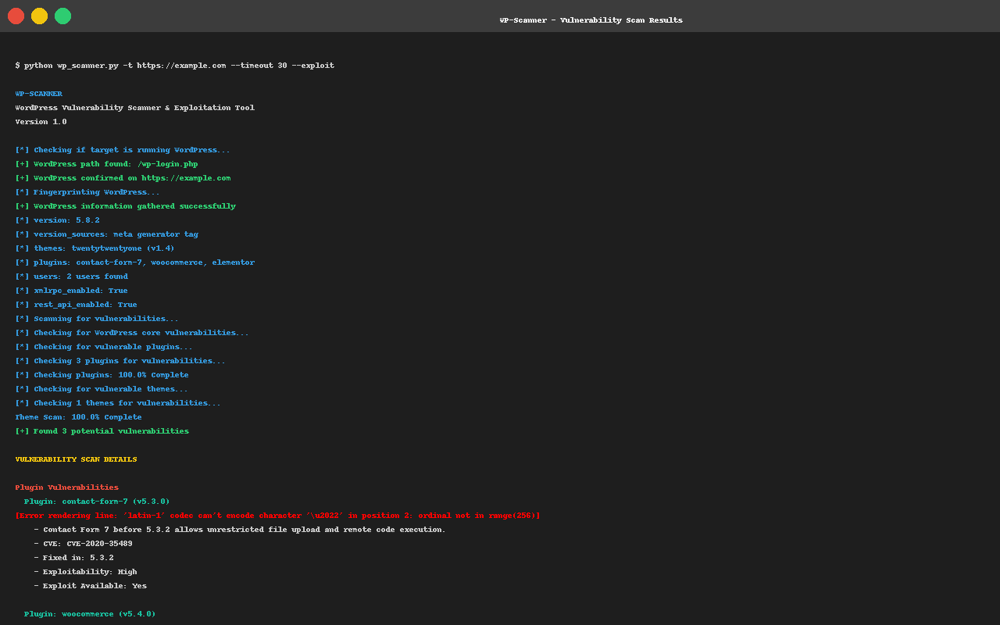
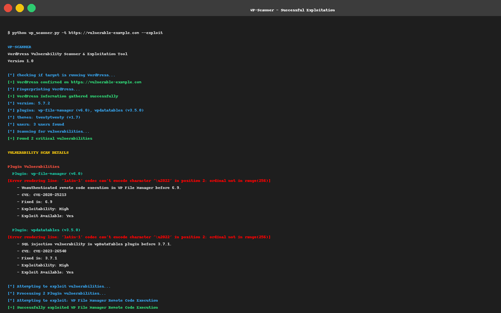

# WP-Scanner


**Advanced WordPress Vulnerability Scanner and Exploitation Tool**

---

## Features

- Comprehensive WordPress fingerprinting (version, themes, plugins, users)
- Vulnerability scanning for WordPress core, themes, and plugins
- Active exploitation of detected vulnerabilities
- Detailed reporting of vulnerabilities and exploitation results
- Mass scanning capability for multiple targets
- Automatic updates for both tool and vulnerability databases

## Installation

### Prerequisites

- Python 3.7+
- Git (for easy updates)

### Setup

1. Clone the repository:
```bash
git clone https://github.com/Triotion/wp-scanner.git
cd wp-scanner
```

2. Install dependencies:
```bash
pip install -r requirements.txt
```

3. Run the tool:
```bash
python wp_scanner.py -h
```

## Usage

### Basic Scan

```bash
python wp_scanner.py -t example.com
```

### Scan with Exploitation

```bash
python wp_scanner.py -t example.com --exploit
```

### Mass Scan from File

```bash
python wp_scanner.py -l targets.txt --mass-output-dir mass_results
```

### Update Tool and Vulnerability Databases

```bash
python wp_scanner.py --update
```

### Scan with Auto-Update

```bash
python wp_scanner.py -t example.com --auto-update
```

### Additional Options

```
usage: wp_scanner.py [-h] [-t TARGET] [-l TARGETS_FILE] [-o OUTPUT]
                     [--threads THREADS] [--timeout TIMEOUT]
                     [--user-agent USER_AGENT] [--proxy PROXY] [--exploit]
                     [-v] [--mass-output-dir MASS_OUTPUT_DIR] [--update]
                     [--auto-update]

WordPress Vulnerability Scanner and Exploitation Tool

optional arguments:
  -h, --help            show this help message and exit
  -t TARGET, --target TARGET
                        Target WordPress site URL
  -l TARGETS_FILE, --targets-file TARGETS_FILE
                        File containing list of target URLs (one per line)
  -o OUTPUT, --output OUTPUT
                        Output directory for scan results
  --threads THREADS     Number of threads (default: 5)
  --timeout TIMEOUT     Request timeout in seconds (default: 30)
  --user-agent USER_AGENT
                        Custom User-Agent string
  --proxy PROXY         Proxy URL (e.g., http://127.0.0.1:8080)
  --exploit             Attempt to exploit found vulnerabilities
  -v, --verbose         Enable verbose output
  --mass-output-dir MASS_OUTPUT_DIR
                        Base directory for mass scan results
  --update              Update the tool and vulnerability databases
  --auto-update         Automatically update the tool before scanning
```

## Demo

### Vulnerability Scanning



### Successful Exploitation



## Output Structure

The tool creates a results directory for each scan with the following structure:

```
results_example.com_20240101_120000/
├── scan_results.log          # Detailed log of the scanning process
├── wp_info.json              # WordPress information (version, themes, plugins, etc.)
├── vulnerabilities.json      # Detected vulnerabilities
└── exploitation_results.json # Results of exploitation attempts (if --exploit is used)
```

## Disclaimer

This tool is intended for ethical use only. Always obtain proper authorization before scanning or attempting to exploit any website. The creators of this tool are not responsible for any misuse or damage caused by this program.

## Contributing

Contributions are welcome! Please feel free to submit a Pull Request.

## Donations

If you find this tool valuable, consider donating to support ongoing development:

- BTC: bc1qtkm7dzjp76gx8t9c02pshfd8rzarj6gj9yzglu
- ETH: 0x88Aa0E09a5A62919321f38Fb4782A17f4dc91A9B
- XMR: 0x6730c52B3369fD22E3ACc6090a3Ee7d5C617aBE0

## License

This project is licensed under the MIT License - see the LICENSE file for details. 